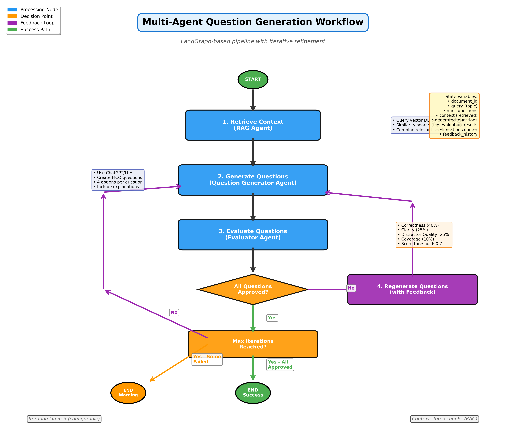
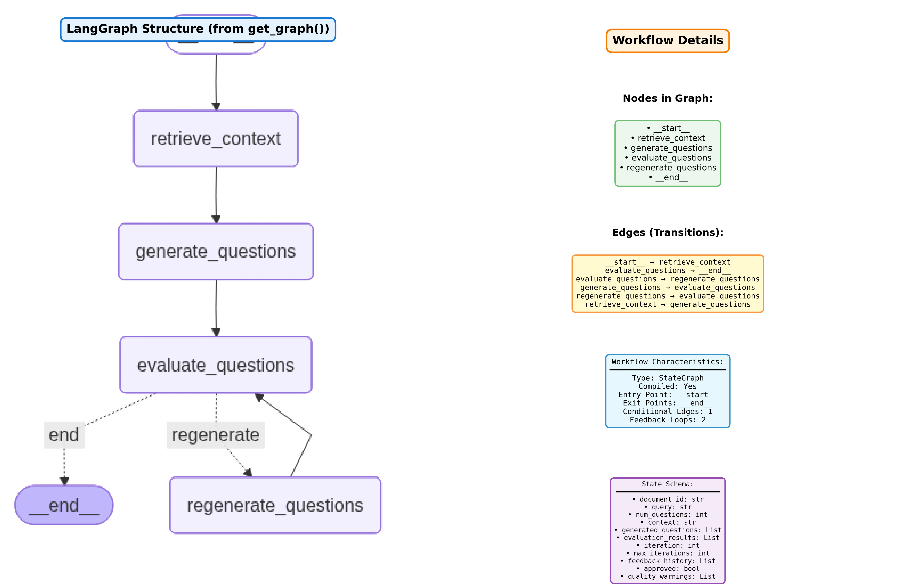

# QA Generation System

**Intelligent Question & Answer Generation from PDF Documents**

A production-ready FastAPI application that leverages LangGraph multi-agent workflows and LandingAI's Document Parse & Transform (DPT) to automatically generate high-quality Multiple Choice Questions (MCQs) from PDF documents.

---


---
## Features

### Core Capabilities

- **PDF Processing**: Intelligent document chunking using LandingAI DPT or legacy fallback
- **Multi-Agent Workflow**: LangGraph-powered iterative question generation and evaluation
- **Quality Control**: Automated evaluation with feedback loops for continuous improvement
- **Semantic Search**: ChromaDB vector store for context-aware retrieval
- **Filename-Based API**: User-friendly API accepting filenames instead of internal IDs
- **Rich Metadata**: Page numbers, chunk types, source attribution

### Advanced Features

- **Semantic Chunking**: Vision model-based document understanding (LandingAI DPT)
- **Table Detection**: Automatic identification and extraction of tabular data
- **Iterative Refinement**: Up to 3 iterations of question improvement based on evaluation feedback
- **Configurable Quality**: Adjustable score thresholds and evaluation criteria
- **Graceful Degradation**: Automatic fallback to legacy chunking if DPT fails

---

## Table of Contents

- [Architecture](#architecture)
- [Quick Start](#quick-start)
- [Installation](#installation)
- [Configuration](#configuration)
- [API Documentation](#api-documentation)
- [Workflow Details](#workflow-details)
- [LandingAI Integration](#landingai-integration)
- [Development](#development)
- [Testing](#testing)
- [Troubleshooting](#troubleshooting)
- [Contributing](#contributing)

---

## Architecture

### System Overview

```
┌─────────────┐
│   FastAPI   │
│     API     │
└──────┬──────┘
       │
       ├──────────────────┬──────────────────┬───────────────┐
       │                  │                  │               │
┌──────▼──────┐  ┌───────▼────────┐  ┌──────▼──────┐  ┌──────▼──────┐
│   Ingest    │  │   Questions    │  │  Document   │  │   Vector    │
│  Endpoint   │  │   Endpoint     │  │   Manager   │  │    Store    │
└──────┬──────┘  └───────┬────────┘  └──────┬──────┘  └──────┬──────┘
       │                 │                  │                │
       │                 │                  │                │
┌──────▼──────────────────▼─────────────────▼────────────────▼──────┐
│                      Core Services Layer                          │
├───────────────────────────────────────────────────────────────────┤
│                                                                   │
│  ┌─────────────┐  ┌──────────────┐  ┌────────────┐  ┌───────────┐ │
│  │     PDF     │  │   LangGraph  │  │  ChromaDB  │  │  OpenAI   │ │
│  │  Processor  │  │   Workflow   │  │   Vector   │  │    LLM    │ │
│  │             │  │              │  │    Store   │  │           │ │
│  │ ┌─────────┐ │  │ ┌──────────┐ │  │            │  │           │ │
│  │ │LandingAI│ │  │ │Retriever │ │  │            │  │           │ │
│  │ │   DPT   │ │  │ │Generator │ │  │            │  │           │ │
│  │ └─────────┘ │  │ │Evaluator │ │  │            │  │           │ │
│  └─────────────┘  │ └──────────┘ │  │            │  │           │ │
│                   └──────────────┘  └────────────┘  └───────────┘ │
└───────────────────────────────────────────────────────────────────┘
```

### Technology Stack

| Component | Technology | Purpose |
|-----------|-----------|---------|
| **API Framework** | FastAPI | High-performance async web framework |
| **Agent Framework** | LangGraph | Multi-agent workflow orchestration |
| **LLM** | OpenAI GPT-4o-mini | Question generation and evaluation |
| **Vector DB** | ChromaDB | Semantic search and retrieval |
| **PDF Processing** | LandingAI DPT | Vision-based document understanding |
| **Embeddings** | OpenAI text-embedding-3-small | Text vectorization |
| **Document Parsing** | pdfplumber | Fallback PDF text extraction |

---

## Quick Start

### 1. Clone Repository

```bash
git clone <repository-url>
cd qa-gen
```

### 2. Set Up Environment

```bash
# Create virtual environment
python3 -m venv venv
source venv/bin/activate  # On Windows: venv\Scripts\activate

# Install dependencies
pip install -r requirements.txt
```

### 3. Configure Environment Variables

Create a `.env` file:

```bash
# OpenAI Configuration
OPENAI_API_KEY=your-openai-api-key
OPENAI_MODEL=gpt-4o-mini
EMBEDDING_MODEL=text-embedding-3-small

# LandingAI Configuration (Optional but Recommended)
VISION_AGENT_API_KEY=your-landingai-api-key
USE_LANDINGAI_CHUNKING=true
LANDINGAI_DPT_MODEL=dpt-2-latest

# ChromaDB Configuration
CHROMA_PERSIST_DIR=./chroma_db

# Document Processing
CHUNK_SIZE=1000
CHUNK_OVERLAP=200
RETRIEVAL_TOP_K=5

# Agent Configuration
MAX_ITERATIONS=3
MIN_QUESTION_SCORE=0.7

# Application
UPLOAD_DIR=./uploads
DOCUMENT_REGISTRY_PATH=./chroma_db/documents.json
```

### 4. Run Application

```bash
uvicorn app.main:app --reload
```

Access the API at: `http://localhost:8000`
Swagger docs at: `http://localhost:8000/docs`

---

## Installation

### Prerequisites

- Python 3.12 or higher
- OpenAI API key
- LandingAI API key (optional, for semantic chunking)

### Step-by-Step Installation

```bash
# 1. Create virtual environment
python3 -m venv venv
source venv/bin/activate

# 2. Upgrade pip
pip install --upgrade pip

# 3. Install dependencies
pip install -r requirements.txt

# 4. Create necessary directories
mkdir -p uploads chroma_db test_data

# 5. Copy environment template
cp .env.example .env  # Edit with your API keys

# 6. Verify installation
python -c "from app.main import app; print('Installation successful')"
```

---

## Configuration

### Environment Variables

#### OpenAI Settings

```bash
OPENAI_API_KEY=sk-...                    # Required: Your OpenAI API key
OPENAI_MODEL=gpt-4o-mini                 # LLM model for generation
EMBEDDING_MODEL=text-embedding-3-small   # Embedding model
```

#### LandingAI Settings

```bash
VISION_AGENT_API_KEY=your-key           # Optional: LandingAI API key
USE_LANDINGAI_CHUNKING=true             # Toggle: true/false
LANDINGAI_DPT_MODEL=dpt-2-latest        # DPT model version
```

#### Document Processing

```bash
CHUNK_SIZE=1000                         # Max characters per chunk
CHUNK_OVERLAP=200                       # Overlap between chunks
RETRIEVAL_TOP_K=5                       # Number of chunks to retrieve
MIN_RELEVANCE_THRESHOLD=0.3             # Minimum relevance score for retrieval
```

#### Quality Control

```bash
MAX_ITERATIONS=3                        # Max refinement iterations
MIN_QUESTION_SCORE=0.7                  # Approval threshold (0.0-1.0)
```

### Chunking Strategies

| Strategy | When to Use | Quality | Speed |
|----------|-------------|---------|-------|
| **LandingAI DPT** | Production, complex docs | High | Moderate |
| **Legacy Page-based** | Development, simple docs | Good | Fast |

**Recommendation**: Use LandingAI DPT for production quality, legacy for faster iteration during development.

---

## API Documentation

### Base URL

```
http://localhost:8000
```

### Endpoints

#### 1. Upload & Ingest PDF

```http
POST /api/ingest
Content-Type: multipart/form-data
```

**Request:**
```bash
curl -X POST "http://localhost:8000/api/ingest" \
  -F "file=@document.pdf"
```

**Response:**
```json
{
  "document_id": "e4d9a43f-40bb-46fb-872d-ef6922067da2",
  "filename": "document.pdf",
  "total_pages": 31,
  "total_chunks": 261,
  "upload_date": "2025-11-29T13:44:00"
}
```

#### 2. Generate Questions

```http
POST /api/generate/questions
Content-Type: application/json
```

**Request:**
```bash
curl -X POST "http://localhost:8000/api/generate/questions" \
  -H "Content-Type: application/json" \
  -d '{
    "filename": "document.pdf",
    "query": "machine learning basics",
    "num_questions": 5
  }'
```

**Request Schema:**
```json
{
  "filename": "document.pdf",          // Filename of uploaded PDF
  "query": "topic or concept",         // Topic for question generation
  "num_questions": 5                   // Number of questions (1-20)
}
```

**Response:**
```json
{
  "questions": [
    {
      "question": "What is supervised learning?",
      "options": [
        "Learning with labeled data",
        "Learning without data",
        "Learning with unlabeled data",
        "Learning from errors only"
      ],
      "correct_answer": 0,
      "explanation": "Supervised learning uses labeled training data...",
      "source_section": "Chunk 45 (text)",
      "difficulty": null
    }
  ],
  "retrieval_context": "Context excerpt...",
  "evaluation_summary": {
    "total_generated": 5,
    "total_approved": 5,
    "average_score": 0.85
  },
  "quality_warnings": null,
  "iterations_used": 1,
  "total_questions_generated": 5
}
```

#### 3. Health Check

```http
GET /health
```

**Response:**
```json
{
  "status": "healthy",
  "version": "1.0.0",
  "chroma_status": "connected"
}
```

---

## Workflow Details

### Multi-Agent Question Generation Pipeline




The workflow consists of four main phases orchestrated by LangGraph's state machine:

#### Phase 1: Context Retrieval (RAG Agent)

```
Input: document_id, query
Process:
  1. Query vector database with topic
  2. Retrieve top-k relevant chunks (default: 5)
  3. Filter by relevance threshold (MIN_RELEVANCE_THRESHOLD)
  4. Combine chunks with source metadata
Output: Contextual text passages
```

#### Phase 2: Question Generation (Generator Agent)

```
Input: Context, query, num_questions, feedback (if iteration > 1)
Process:
  1. Analyze context for key concepts
  2. Generate MCQ questions with 4 options each
  3. Create explanations and source attribution
Output: List of MCQ questions (JSON)
```

#### Phase 3: Evaluation (Evaluator Agent)

```
Input: Questions, context
Evaluation Criteria:
  - Correctness (40%): Answer derivable from context
  - Clarity (25%): Unambiguous wording
  - Distractor Quality (25%): Plausible wrong options
  - Coverage (10%): Tests important concepts

Process:
  1. Score each question on criteria (0.0-1.0)
  2. Calculate weighted average
  3. Approve if score >= MIN_QUESTION_SCORE
Output: Evaluation results with feedback
```

#### Phase 4: Decision Point

```
If ALL questions approved:
  → Return questions to user

If some questions failed AND iterations < MAX_ITERATIONS:
  → Collect feedback from failed questions
  → Regenerate with feedback
  → Return to Phase 2

If iterations >= MAX_ITERATIONS:
  → Return best available questions
  → Include quality warnings
```

### State Management

```python
{
  "document_id": str,
  "query": str,
  "num_questions": int,
  "context": str,                    # Retrieved text
  "generated_questions": List[Dict],
  "evaluation_results": List[Dict],
  "iteration": int,
  "max_iterations": int,
  "feedback_history": List[str],     # Cumulative feedback
  "approved": bool,
  "quality_warnings": List[str]
}
```

---

## LandingAI Integration

### Why LandingAI DPT?

LandingAI's Document Parse & Transform uses vision models to understand document structure, providing:

- **Semantic Chunking**: Respects logical boundaries (paragraphs, sections)
- **Table Detection**: Extracts structured data separately
- **Better QA Quality**: Contextually coherent chunks improve question relevance

### Comparison: LandingAI vs Legacy

| Metric | Legacy Chunking | LandingAI DPT |
|--------|----------------|---------------|
| Chunks Created | 51 | 261 |
| Avg Chunk Size | 733 chars | 188 chars |
| Table Detection | No | Yes (2 tables) |
| Semantic Boundaries | Arbitrary | Intelligent |
| Best For | Simple docs | Complex docs |

### Chunk Types

LandingAI DPT identifies 8 chunk types:

| Type | Description | Used for QA |
|------|-------------|-------------|
| **text** | Paragraphs, titles, lists | Yes (Primary) |
| **table** | Grid-structured data | Yes (Primary) |
| marginalia | Headers, footers | No (Excluded) |
| figure | Images, diagrams | No (Excluded) |
| logo | Brand identifiers | No (Excluded) |
| card | ID documents | No (Excluded) |
| attestation | Signatures, stamps | No (Excluded) |
| scan_code | QR codes, barcodes | No (Excluded) |

### Setup Instructions

1. **Get API Key**: Sign up at [landing.ai](https://landing.ai)
2. **Configure**: Add to `.env`
   ```bash
   VISION_AGENT_API_KEY=your-key
   USE_LANDINGAI_CHUNKING=true
   ```
3. **Test**: Run `python test_landingai_chunking.py`

### Fallback Behavior

If LandingAI DPT fails (network issues, API errors), the system automatically falls back to legacy page-based chunking with a warning logged.

---

## Development

### Project Structure

```
qa-gen/
├── app/
│   ├── api/                      # API endpoints
│   │   └── endpoints/
│   │       ├── ingest.py         # PDF upload endpoint
│   │       └── questions.py      # Question generation endpoint
│   ├── core/                     # Core configuration
│   │   ├── config.py             # Settings management
│   │   └── dependencies.py       # Dependency injection
│   ├── models/                   # Data models
│   │   └── schemas.py            # Pydantic schemas
│   ├── services/                 # Business logic
│   │   ├── pdf_processor.py     # PDF chunking (LandingAI + legacy)
│   │   ├── vector_store.py      # ChromaDB operations
│   │   ├── document_manager.py  # Document registry
│   │   └── agent_workflow.py    # LangGraph multi-agent workflow
│   └── main.py                   # FastAPI app
├── tests/                        # Test suite
├── uploads/                      # Uploaded PDFs
├── chroma_db/                    # Vector database
├── test_data/                    # Sample PDFs
├── requirements.txt              # Python dependencies
├── .env                          # Environment variables
├── Dockerfile                    # Docker container definition
├── docker-compose.yml            # Docker orchestration
└── README.md                     # This file
```

### Running Tests

```bash
# Run all tests
pytest

# Run with coverage
pytest --cov=app --cov-report=html

# Run specific test file
pytest tests/test_pdf_processor.py

# Verbose output
pytest -v
```

### Code Quality

```bash
# Format code
black app/ tests/

# Lint
ruff check app/ tests/

# Type checking
mypy app/
```

### Local Development

```bash
# Hot reload
uvicorn app.main:app --reload --host 0.0.0.0 --port 8000

# Debug mode
uvicorn app.main:app --reload --log-level debug

# Access logs
tail -f logs/app.log
```

---

## Testing

### Manual Testing

#### Test PDF Upload

```bash
curl -X POST "http://localhost:8000/api/ingest" \
  -F "file=@test_data/A Quick Algebra Review.pdf"
```

#### Test Question Generation

```bash
curl -X POST "http://localhost:8000/api/generate/questions" \
  -H "Content-Type: application/json" \
  -d '{
    "filename": "A Quick Algebra Review.pdf",
    "query": "solving quadratic equations",
    "num_questions": 3
  }'
```

### Automated Tests

```bash
# PDF Processing
python test_landingai_chunking.py
python test_simplified_chunking.py

# Workflow Visualization
python plot_langgraph_workflow.py
python create_detailed_graph.py
```

### Test Coverage

- PDF Processing (both LandingAI and legacy)
- Vector Store Operations
- Document Management
- Question Generation Workflow
- API Endpoints

---

## Troubleshooting

### Common Issues

#### 1. ModuleNotFoundError: No module named 'landingai_ade'

```bash
pip install landingai-ade
```

#### 2. OpenAI API Key Error

```bash
# Verify key is set
echo $OPENAI_API_KEY

# Or check .env file
cat .env | grep OPENAI_API_KEY
```

#### 3. ChromaDB Connection Error

```bash
# Ensure ChromaDB directory exists
mkdir -p chroma_db

# Check permissions
ls -la chroma_db/
```

#### 4. LandingAI Authentication Failed

```bash
# Check API key format (no spaces)
grep VISION_AGENT_API_KEY .env

# Test connection
python -c "from landingai_ade import LandingAIADE; LandingAIADE()"
```

#### 5. "Falling back to legacy chunking"

This is normal if:
- `USE_LANDINGAI_CHUNKING=false`
- LandingAI API is unreachable
- API key is invalid

Check logs for specific error details.

#### 6. "No relevant content found for topic"

This warning appears when:
- The queried topic does not exist in the uploaded document
- The relevance score is below `MIN_RELEVANCE_THRESHOLD`

Solution: Try a different topic that exists in the document, or adjust the relevance threshold.

### Debug Mode

```bash
# Enable detailed logging
export LOG_LEVEL=DEBUG
uvicorn app.main:app --reload --log-level debug
```

### Getting Help

1. Check logs: `tail -f logs/app.log`
2. Review error messages in API response
3. Consult [FastAPI docs](https://fastapi.tiangolo.com/)
4. Check [LangGraph docs](https://github.com/langchain-ai/langgraph)
5. Review [LandingAI docs](https://docs.landing.ai)

---

## Performance Optimization

### Chunking Performance

| Strategy | Speed | Quality | Cost |
|----------|-------|---------|------|
| Legacy | Fast (1-2s) | Good | Free |
| LandingAI DPT | Moderate (5-10s) | Excellent | Paid |

### Optimization Tips

1. **Use Caching**: Enable ChromaDB persistence
2. **Batch Processing**: Process multiple PDFs in parallel
3. **Adjust Chunk Size**: Smaller chunks = more precision, larger = more context
4. **Limit Iterations**: Reduce `MAX_ITERATIONS` for faster responses
5. **Model Selection**: `gpt-4o-mini` is faster than `gpt-4`

---

## Security

### Best Practices

- Store API keys in `.env`, never commit to Git
- Add `.env` to `.gitignore`
- Use environment variables in production
- Validate uploaded file types (PDF only)
- Limit file upload sizes
- Sanitize user inputs

### Production Deployment

```bash
# Use production-grade ASGI server
gunicorn app.main:app -w 4 -k uvicorn.workers.UvicornWorker

# Set secure environment variables
export OPENAI_API_KEY=<secret>
export VISION_AGENT_API_KEY=<secret>

# Enable HTTPS
# Configure reverse proxy (Nginx, Caddy)
```

---

## Roadmap

- [ ] Support for DOCX/TXT files
- [ ] Question difficulty classification
- [ ] Custom evaluation criteria
- [ ] Question export (JSON, CSV, Markdown)
- [ ] Batch question generation
- [ ] Web UI for document upload
- [ ] Question bank management
- [ ] Analytics dashboard

---

## Contributing

Contributions are welcome! Please follow these guidelines:

1. Fork the repository
2. Create a feature branch (`git checkout -b feature/amazing-feature`)
3. Commit your changes (`git commit -m 'Add amazing feature'`)
4. Push to the branch (`git push origin feature/amazing-feature`)
5. Open a Pull Request

### Code Standards

- Follow PEP 8
- Add docstrings to functions
- Write tests for new features
- Update README for new configuration options

---

## License

This project is licensed under the MIT License - see the LICENSE file for details.

---

## Acknowledgments

- **OpenAI** - GPT models and embeddings
- **LangChain/LangGraph** - Agent framework
- **LandingAI** - Document Parse & Transform
- **ChromaDB** - Vector database
- **FastAPI** - Web framework

---

## Contact

For questions or support, please open an issue on GitHub.

---

**Built with FastAPI, LangGraph, and LandingAI DPT**
